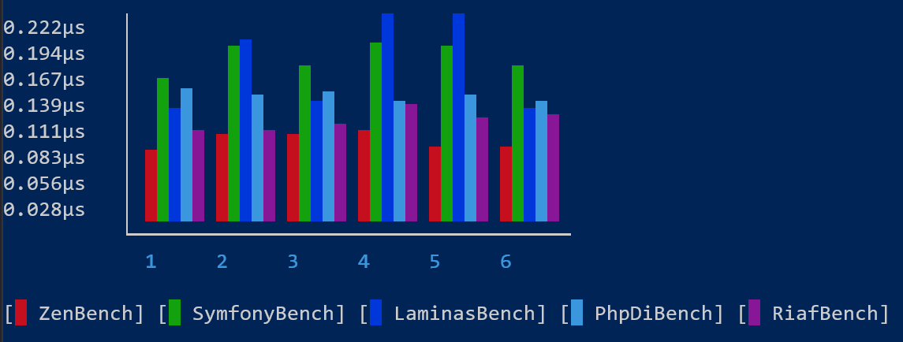
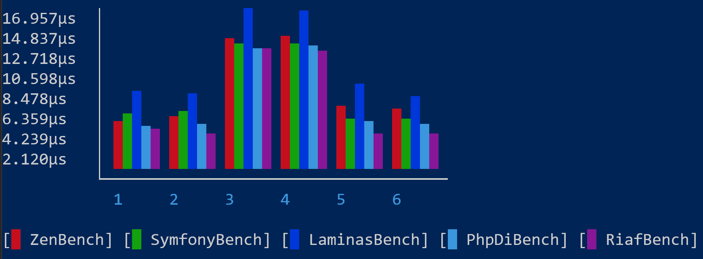
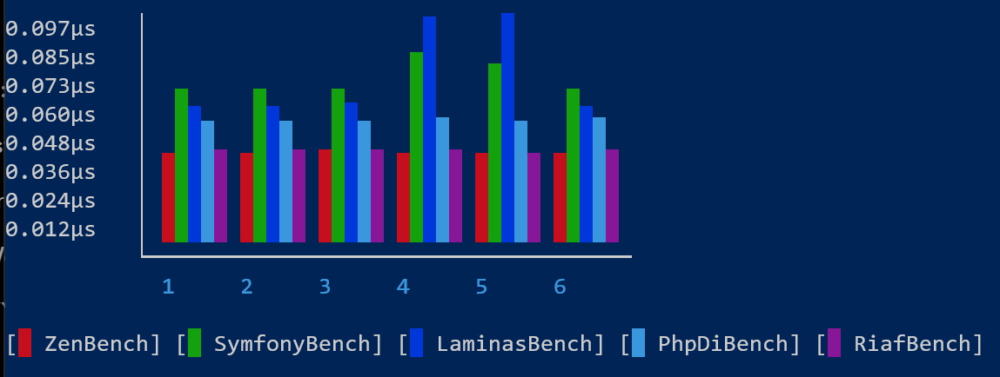

# Results

Just like [last time with the router benchmark](https://github.com/l3tum/php-router-benchmark) I've chosen to write my own Container.
Unlike the Router though, we did use an actual Container for Victoria. That's not to say that it doesn't add overhead, but development
without one is just a PITA. Nevertheless I thought I could improve on current Containers.

For the interested: While building the benchmarks I came across an interesting [Optimization](./Curious_Optimization.md)
that I didn't think PHP would do. 

## Disclaimer

Usually when you have multiple implementations (Containers) of a Standard (PSR-11), these implementations will compete
on two metrics: Performance and Extra Features.

Extra Features are hard to quantify as the only two possible values are `I need it` and `I don't need it`.

That leaves us with Performance, which I tried to measure with these benchmarks here.

In order to compare Containers fairly a core set of features was devised that every Container had to implement
and was benchmarked on:
- Standard PSR-11 Features (Get/Has Service)
- Autowiring
- Aliasing
- Implementation-for-Interface

These benchmarks were performed with an auto-generated list of 100 Services.
I thought this was a good middle ground between small apps and big apps.

## Honorary Mentions

Three Container Implementations that were tested (and the benchmarks are in this repo) are Yii, League and Laminas.

League unfortunately does not offer a method to configure autowiring or service discovery ahead of time. This means
that League has to figure both out during the actual benchmark, resulting in abysmal performance. While this could be avoided by simply ``get``ing the Service
beforehand, this felt like a hack and not something that should be encouraged by a benchmark.

Although Yii does offer a method to configure autowiring and service discovery ahead of time,
it does not perform as well as one would expect. It actually performs around 10x worse than most other Containers.
In order to make the results accessible Yii was dropped from the comparisons.

Laminas does not offer autowiring out-of-the-box. While there are benchmarks with autowiring in this repo, they rely on a 
third-party library ([bluepsyduck/laminas-autowire-factory](https://github.com/BluePsyduck/laminas-autowire-factory)).
Since it does perform somewhat competitively though, I thought I'd leave it in.

## Actual Results Now



Okay, you may wonder now: "Hey, Riaf isn't the fastest! What is this?!".
And I did so, too. How could anything be faster than my hobby project? That's illegal!

Well, truth be told, I knew of [Zen](https://github.com/woohoolabs/zen) beforehand. It was the inspiration for writing Riaf and for using `match`, as it is
using that itself as well. But how is it faster than Riaf?

It mostly comes down to the optimizations *around* the `match` itself. Riaf liberally used auto-generated factory methods
which did make the generated code easier to reason about, but obviously cost a ton of performance. Function calls should be avoided at all costs.
That's partly why PHP-DI performs worse: It's predominantly using function calls. 

With that in mind here's the updated results, after a [round of optimizations](https://github.com/l3tum/RiafCore/pull/31).



With these results in mind, it's quite clear that Riaf is, in addition to the fastest Router, also the fastest Container.
Interestingly though, unlike with Routers, Symfony performs surprisingly well and even beats out Zen sometimes.
That's most likely because Zen is using factory methods (like Riaf did before) and thus has this overhead.

Somewhat curiously PHP-DI also performs pretty well in comparison, which I did not expect at all.

Of course, as with the Router, increasing the number of Services will also rely more on the scaling of `match` and thus likely beat out other
Containers by a larger margin. If you want to read my (very naive) explanation on why `match` is faster you can look at the 
[router benchmark](https://github.com/l3tum/php-router-benchmark).

As you may have noticed, the absolute timings are much higher now. That's mostly because I reduced the times an individual benchmark
tries to fetch a Service. The reasoning behind that is pretty simple: Increasing the number of times a Service is fetched
flattens out the curve of timings and ultimately benchmarks a simple array-access, since the Services were defined as Singletons
and thus saved by the Container in an Array that it would use in later calls. I did not think of that behaviour before
running the first benchmarks, however re-running the benchmarks now it does not seem to change the overall scaling much.

## HAS Benchmarked

"Wait, why are we benchmarking `has` now?". I honestly thought it was wasted time to benchmark it, there can't be much variation, right?
And personally, I've never used the method anyways.

Surprisingly though, there are some differences between Containers.



Unsurprisingly the two Containers making use of `match` (Zen and Riaf) top the benchmarks
with the others somewhat close together. The differences (and outliers) can be mostly explained by the way the Containers
save the different variants of keys (Aliases, Interface => Implementation, plain Service).

## Drawbacks

As with Routers, Riaf comes with a few drawbacks compared to Symfony specifically. Riaf does not support tagging (yet).
It also does not support calling methods on Instantiation (yet).

## Table of Results
                      
### GET

I've subtracted the results with 22μs for the GET graph so that the difference is clearer (as you can't set a baseline for the Y axis in PHPBench).

````
+--------------+--------------------------+-----------+----------+
| benchmark    | set                      | mem_peak  | mode     |
+--------------+--------------------------+-----------+----------+
| ZenBench     | GET Best Case            | 941.536kb | 27.018μs |
| ZenBench     | GET Worst Case Service99 | 941.536kb | 27.340μs |
| ZenBench     | GET Implementation       | 941.552kb | 35.695μs |
| ZenBench     | GET Interface            | 941.552kb | 35.845μs |
| ZenBench     | GET Alias                | 941.520kb | 28.436μs |
| ZenBench     | GET Service For Alias    | 941.536kb | 28.260μs |
| SymfonyBench | GET Best Case            | 941.544kb | 27.774μs |
| SymfonyBench | GET Worst Case Service99 | 941.544kb | 27.875μs |
| SymfonyBench | GET Implementation       | 941.560kb | 35.006μs |
| SymfonyBench | GET Interface            | 941.560kb | 35.144μs |
| SymfonyBench | GET Alias                | 941.528kb | 27.205μs |
| SymfonyBench | GET Service For Alias    | 941.544kb | 27.257μs |
| LaminasBench | GET Best Case            | 941.544kb | 30.048μs |
| LaminasBench | GET Worst Case Service99 | 941.544kb | 29.890μs |
| LaminasBench | GET Implementation       | 941.560kb | 38.957μs |
| LaminasBench | GET Interface            | 941.560kb | 38.558μs |
| LaminasBench | GET Alias                | 941.528kb | 30.849μs |
| LaminasBench | GET Service For Alias    | 941.544kb | 29.678μs |
| PhpDiBench   | GET Best Case            | 941.544kb | 26.438μs |
| PhpDiBench   | GET Worst Case Service99 | 941.544kb | 26.665μs |
| PhpDiBench   | GET Implementation       | 941.560kb | 34.614μs |
| PhpDiBench   | GET Interface            | 941.560kb | 34.908μs |
| PhpDiBench   | GET Alias                | 941.528kb | 27.000μs |
| PhpDiBench   | GET Service For Alias    | 941.544kb | 26.734μs |
| RiafBench    | GET Best Case            | 954.632kb | 26.205μs |
| RiafBench    | GET Worst Case Service99 | 954.632kb | 25.666μs |
| RiafBench    | GET Implementation       | 954.656kb | 34.667μs |
| RiafBench    | GET Interface            | 954.656kb | 34.283μs |
| RiafBench    | GET Alias                | 954.600kb | 25.579μs |
| RiafBench    | GET Service For Alias    | 954.632kb | 25.666μs |
+--------------+--------------------------+-----------+----------+
````

### HAS

````
+--------------+--------------------------+-----------+----------+
| benchmark    | set                      | mem_peak  | mode     |
+--------------+--------------------------+-----------+----------+
| ZenBench     | HAS Best Case            | 941.536kb | 0.039μs  |
| ZenBench     | HAS Worst Case Service99 | 941.536kb | 0.039μs  |
| ZenBench     | HAS Implementation       | 941.552kb | 0.040μs  |
| ZenBench     | HAS Interface            | 941.552kb | 0.039μs  |
| ZenBench     | HAS Alias                | 941.520kb | 0.038μs  |
| ZenBench     | HAS Service For Alias    | 941.536kb | 0.039μs  |
| SymfonyBench | HAS Best Case            | 941.544kb | 0.066μs  |
| SymfonyBench | HAS Worst Case Service99 | 941.544kb | 0.066μs  |
| SymfonyBench | HAS Implementation       | 941.560kb | 0.066μs  |
| SymfonyBench | HAS Interface            | 941.560kb | 0.082μs  |
| SymfonyBench | HAS Alias                | 941.528kb | 0.076μs  |
| SymfonyBench | HAS Service For Alias    | 941.544kb | 0.065μs  |
| LaminasBench | HAS Best Case            | 941.544kb | 0.058μs  |
| LaminasBench | HAS Worst Case Service99 | 941.544kb | 0.058μs  |
| LaminasBench | HAS Implementation       | 941.560kb | 0.059μs  |
| LaminasBench | HAS Interface            | 941.560kb | 0.095μs  |
| LaminasBench | HAS Alias                | 941.528kb | 0.096μs  |
| LaminasBench | HAS Service For Alias    | 941.544kb | 0.057μs  |
| PhpDiBench   | HAS Best Case            | 941.544kb | 0.052μs  |
| PhpDiBench   | HAS Worst Case Service99 | 941.544kb | 0.052μs  |
| PhpDiBench   | HAS Implementation       | 941.560kb | 0.052μs  |
| PhpDiBench   | HAS Interface            | 941.560kb | 0.053μs  |
| PhpDiBench   | HAS Alias                | 941.528kb | 0.051μs  |
| PhpDiBench   | HAS Service For Alias    | 941.544kb | 0.053μs  |
| RiafBench    | HAS Best Case            | 954.632kb | 0.038μs  |
| RiafBench    | HAS Worst Case Service99 | 954.632kb | 0.038μs  |
| RiafBench    | HAS Implementation       | 954.656kb | 0.038μs  |
| RiafBench    | HAS Interface            | 954.656kb | 0.037μs  |
| RiafBench    | HAS Alias                | 954.600kb | 0.037μs  |
| RiafBench    | HAS Service For Alias    | 954.632kb | 0.039μs  |
+--------------+--------------------------+-----------+----------+
````
